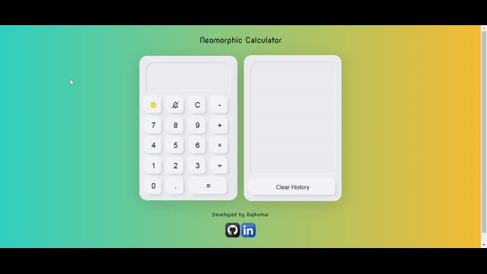

# Neomorphic Calculator

A neomorphic calculator built using JavaScript, jQuery, and HTML. This calculator features a modern design and includes several user-friendly functionalities.

## Features

- **Dark Mode and Light Mode**: Toggle between dark and light modes for a visually pleasing experience. The selected theme mode is saved in the local storage and loaded on page load.

- **Button Click Sound**: Enjoy the satisfying sound of button clicks while using the calculator. The button click sound can be enabled or disabled based on user preference.

- **Calculation History**: Store your calculation history in the local storage. Easily review and reference previous calculations whenever needed. The history can be cleared with a click of a button.

## Usage

Simply open the `index.html` file in a web browser to access the calculator. Use the buttons to perform calculations, toggle modes, enable/disable button click sound, and manage the calculation history.

## Contributing

Contributions are welcome! If you have any suggestions, feature requests, or bug reports, please feel free to open an issue or submit a pull request.
